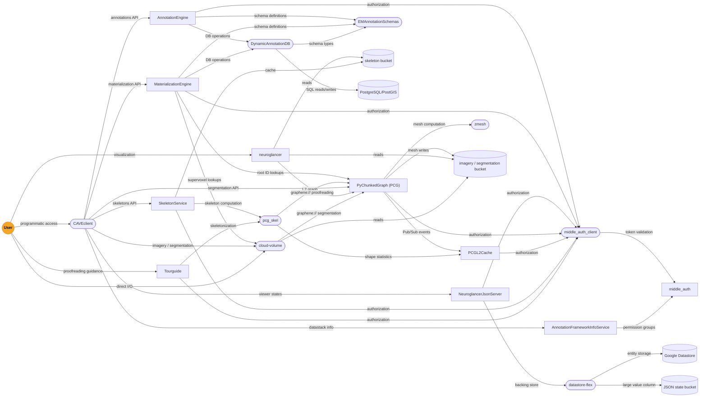

# CAVE Stack Map

High-level summaries of each project in the CAVE (Connectome Annotation Versioning Engine) stack.
Each entry covers what the project does, what it does NOT do, and what other projects it integrates with.

---

## Mind Map

<!--
### Nodes omitted from diagram (ignored for now)
- **dash_on_flask**: Flask + Dash template service; uses middle_auth_client for auth but is a deployment template rather than a core CAVE service.
-->

---

## Micro-Services

### AnnotationEngine
REST API service for creating, reading, and updating spatial annotations in PostgreSQL/PostGIS, completely independent of segmentation state. Does not handle segmentation-to-annotation linkage or versioning — that responsibility belongs to [MaterializationEngine](#materializationengine). Relies on [DynamicAnnotationDB](#dynamicannotationdb) for database operations and [EMAnnotationSchemas](#emannotationschemas) for schema definitions; integrates with [middle_auth](#middle_auth) for authorization.

### AnnotationFrameworkInfoService
Stores and serves core metadata about CAVE deployments: datastacks and aligned volumes; as of v4.0, delegates permission group management to [middle_auth](#middle_auth). Does not manage annotations, segmentation, or user identity. Acts as a configuration registry that other CAVE services look up at runtime.

### middle_auth
Authentication and authorization service layered on top of Google OAuth; manages users, groups, datasets (as permission objects), service-table mappings, and optional terms of service. Does not handle any annotation or segmentation data — it is purely an access-control layer. All other CAVE services delegate token validation to it via [middle_auth_client](#middle_auth_client).

### NeuroglancerJsonServer
Simple REST API for storing and retrieving Neuroglancer JSON viewer states, enabling shareable short-links. Does not interpret or validate the JSON content. Uses [datastore-flex](#datastore-flex) (Google Datastore with optional cloud bucket overflow) as its backing store.

### MaterializationEngine
Creates time-locked "materialized" snapshots of annotations by resolving spatial points to [PyChunkedGraph](#pychunkedgraph-pcg) segmentation root IDs at specific timestamps; also exposes a REST API for querying those frozen databases. Does not generate annotations or manage proofreading — it only joins existing annotation data with a segmentation snapshot. Relies on [DynamicAnnotationDB](#dynamicannotationdb), [EMAnnotationSchemas](#emannotationschemas), [PyChunkedGraph](#pychunkedgraph-pcg) for root ID lookups, and [cloud-volume](#cloud-volume) for supervoxel lookups at spatial coordinates; powered by Celery workers and a Redis broker.

### PyChunkedGraph (PCG)
Core proofreading and segmentation management service that tracks a dynamic supervoxel agglomeration graph backed by Google BigTable, supporting concurrent multi-user edits. Does not store raw imagery, meshes, or annotations directly. The same codebase also hosts the Meshing service (mesh regeneration), which uses [zmesh](#zmesh) for mesh computation; publishes activity via Google Pub/Sub, which drives [PCGL2Cache](#pcgl2cache) and Meshing workers.

### PCGL2Cache
Tracks, caches, and serves precomputed summary statistics (e.g. size, shape features) for "level 2" nodes of the [PyChunkedGraph](#pychunkedgraph-pcg) to speed up downstream skeletonization and analysis. Has a worker component driven by Google Pub/Sub events from [PyChunkedGraph](#pychunkedgraph-pcg). *The README is very sparse; the exact statistics cached are not well documented beyond the CAVE profile description.*

### SkeletonService
Generates, caches (in cloud storage buckets), and serves neuron skeletons in multiple formats (SWC, H5, JSON, precomputed, etc.); any given skeleton is generated once and served from cache on all subsequent requests. Does not implement its own skeletonization algorithm — it delegates skeleton computation to [pcg_skel](#pcg_skel). Best accessed through [CAVEclient](#caveclient).

### Tourguide (Guidebook v2)
Flask web app for generating Neuroglancer links that guide proofreaders to tips and branches in neurons. Does not perform proofreading itself. Uses [pcg_skel](#pcg_skel) for PCG-aware skeletonization. *The README is extremely sparse (a few lines); full scope is inferred from the CAVE profile.*

---

## Libraries

### DynamicAnnotationDB
Python interface library (not a service) for the PostgreSQL/PostGIS databases shared by [AnnotationEngine](#annotationengine) and [MaterializationEngine](#materializationengine); handles CRUD operations, dynamic schema generation, and management of both annotation and segmentation data tables. Tightly coupled to [EMAnnotationSchemas](#emannotationschemas) for schema types and validation.

### EMAnnotationSchemas
Python library defining the schema types for CAVE annotations (e.g. synapse, cell type, reference annotations). Not a service — it is a shared dependency used by both [AnnotationEngine](#annotationengine) and [MaterializationEngine](#materializationengine) to generate and validate database schemas.

### nglui
Python library for programmatically building Neuroglancer viewer states and shareable links from pandas DataFrames. Does not store states itself — link sharing relies on [NeuroglancerJsonServer](#neuroglancerjsonserver). Integrates broadly with CAVE tooling; optionally uses [cloud-volume](#cloud-volume) for uploading skeletons and resolving source info.

### datastore-flex
Small utility library that extends the Google Datastore client to transparently offload large property values to cloud bucket storage. Not a standalone service. Used by [NeuroglancerJsonServer](#neuroglancerjsonserver) to handle JSON states that exceed Datastore entity size limits.

### middle_auth_client
Python library of Flask decorators and helpers that CAVE services use to verify tokens and check permissions against [middle_auth](#middle_auth). Not a service itself — it is imported by [AnnotationEngine](#annotationengine), [MaterializationEngine](#materializationengine), and other Flask-based services.

---

## Access Tools

### CAVEclient
Python client library providing a unified interface to all CAVE microservice endpoints. Contains no server-side logic. Integrates with [AnnotationEngine](#annotationengine), [MaterializationEngine](#materializationengine), [PyChunkedGraph](#pychunkedgraph-pcg), [SkeletonService](#skeletonservice), [AnnotationFrameworkInfoService](#annotationframeworkinfoservice), and [NeuroglancerJsonServer](#neuroglancerjsonserver); optionally depends on [cloud-volume](#cloud-volume) for segmentation and imagery features.

### MeshParty
Python library for loading, analyzing, and visualizing neuron meshes and skeletons, centered on the Skeleton and MeshWork data structures. Does not serve data or run as a service; as of v2.0+ it has a reduced feature scope for general mesh analysis, directing users to pyvista for that work. Uses [cloud-volume](#cloud-volume) for data access; optionally integrates with [CAVEclient](#caveclient) for [PyChunkedGraph](#pychunkedgraph-pcg)-linked meshes.

### pcg_skel
Python library for generating neuron skeletons from [PyChunkedGraph](#pychunkedgraph-pcg) level-2 graphs, using [PCGL2Cache](#pcgl2cache) statistics to improve skeleton quality and speed. Not a standalone service. Used by [SkeletonService](#skeletonservice) and [Tourguide](#tourguide-guidebook-v2); relies on [PyChunkedGraph](#pychunkedgraph-pcg) and [PCGL2Cache](#pcgl2cache).

### ImageryClient
Python library for extracting aligned, co-registered cutouts from imagery and segmentation cloud volumes, suitable for producing publication-ready overlay images. Does not serve data or run as a service. Built on top of [cloud-volume](#cloud-volume).

---

## CAVE-adjacent Tools

### cloud-volume
Serverless Python client for random read/write access to "precomputed" format n-d arrays (imagery, segmentation, meshes, skeletons) stored in cloud object storage (GCS, S3, local filesystem, etc.). Does not process or store data itself. Supports the `graphene://` protocol for [PyChunkedGraph](#pychunkedgraph-pcg)-backed segmentations, making it the primary low-level I/O layer for CAVE data access.

### navis
General-purpose Python library for neuron morphology analysis and visualization: skeletonization, NBLAST similarity, morphometrics, Blender rendering, and more. Not CAVE-specific and does not require CAVE to function. Integrates with [cloud-volume](#cloud-volume) and [CAVEclient](#caveclient) for accessing CAVE-hosted data.

### neuroglancer
WebGL browser-based viewer for volumetric data (imagery, segmentation, meshes, skeletons, annotations); the primary visualization front-end for CAVE data. Not a CAVE-owned or CAVE-specific service — the upstream is maintained by Google; the Seung Lab maintains a fork that adds `graphene://` ([PyChunkedGraph](#pychunkedgraph-pcg)) protocol support for interactive proofreading.

### zmesh
Python library implementing multi-label marching cubes mesh extraction and mesh simplification on dense volumetric labeled arrays, wrapping a high-performance C++ backend. Does not store, retrieve, or serve data — it is a pure-computation library with no network I/O. Used by the Meshing component of [PyChunkedGraph](#pychunkedgraph-pcg) to generate neuron mesh fragments; output can be serialized to Neuroglancer Precomputed format, making it compatible with [cloud-volume](#cloud-volume).

---

## Deployment / Infrastructure

### CAVEdeployment
Bash-script-and-template-based system for deploying all CAVE services to Google Cloud Kubernetes. Does not contain application code. Largely superseded by the [terraform-google-cave](#terraform-google-cave) + [cave-helm-charts](#cave-helm-charts) approach.

### cave-helm-charts
Helm chart repository for deploying CAVE microservices to Kubernetes (primarily targeting GKE). Does not provision cloud infrastructure. Companion to [terraform-google-cave](#terraform-google-cave), which provisions infrastructure and feeds configuration values into these charts via Helmfile.

### terraform-google-cave
Terraform/Terragrunt modules for provisioning all CAVE infrastructure on Google Cloud (GKE clusters, BigTable, Redis, Cloud SQL, Pub/Sub, cloud storage, IAM, etc.). Does not deploy application code directly — it generates configuration values consumed by Helmfile and [cave-helm-charts](#cave-helm-charts). Split into "global" and "local" cluster infrastructure modules.

### global-template
Copier template for scaffolding a "global" CAVE deployment environment (Terragrunt + Helmfile structure) for use with [terraform-google-cave](#terraform-google-cave). *Very sparse — the repository contains little beyond template scaffolding files.* Purpose is analogous to [local-template](#local-template) but targeting the globally-shared CAVE services (auth, info, link-sharing).

### local-template
Copier template for scaffolding a "local" CAVE deployment environment and cluster (Terragrunt + Helmfile structure) for use with [terraform-google-cave](#terraform-google-cave). Companion to [global-template](#global-template) for the dataset-specific local cluster type.

### uwsgi_prometheus_workers
Sidecar utility that scrapes uWSGI worker stats (busy worker count, RSS memory) from a running uWSGI process and exposes them as Prometheus metrics, plus a readiness probe endpoint. *No README is present; purpose was inferred from source code.* Likely deployed alongside any uWSGI-based CAVE service.
